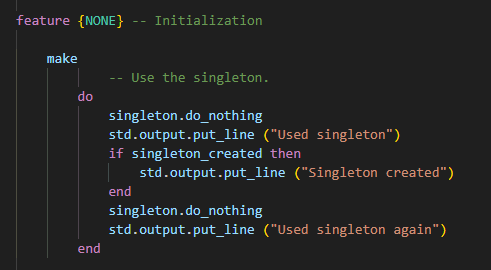
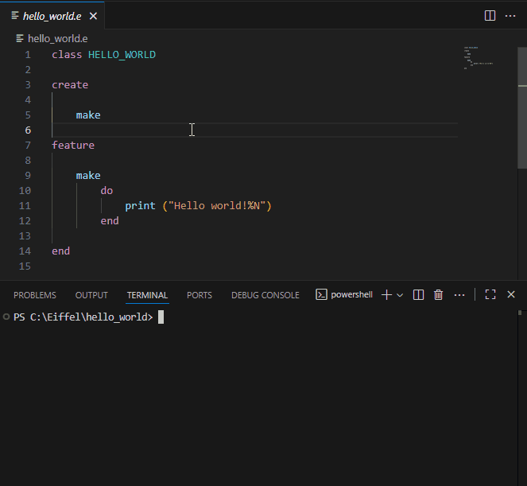
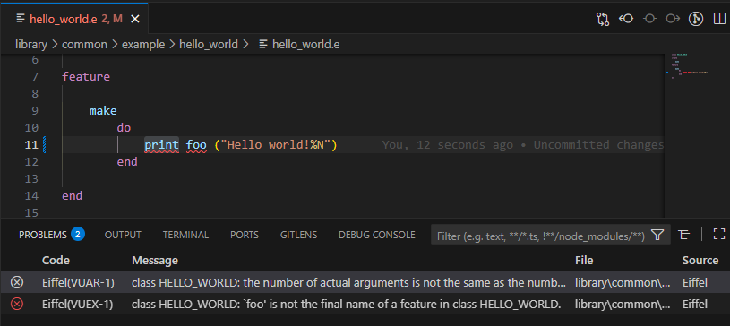

# Gobo Eiffel for Visual Studio Code

Bring the power of the [*Gobo Eiffel*](https://www.gobosoft.com) toolchain directly into Visual Studio Code, providing full language support for the
[Eiffel programming language](https://en.wikipedia.org/wiki/Eiffel_%28programming_language%29).
This extension lets you **edit, compile and run Eiffel programs** seamlessly — ideal for both **beginners discovering Eiffel** and **experienced developers** who want an efficient workflow.

## ✨ Features

* **Syntax highlighting & language support**

  Eiffel keywords, comments and strings are highlighted using an up-to-date Eiffel grammar.

  

* **Compile & run from VS Code**

  * Command to [compile the current Eiffel file](doc/compile_and_run_in_terminal.md) from the *Command Palette* or contextual menus.
  * Automatically run it after compilation in the *Terminal* panel.
  * Set arguments and environment variables using *Launch Configurations*.
  * Generate and use ECF files for more advanced compilation settings.

  

* **Inline error reporting**

  Compilation errors are shown as red squiggles in the editor and in the ***Problems*** panel.
  Clicking an error jumps to its location in your file.

  

* **Integrated Eiffel Terminal**

  Open a pre-configured terminal with *Gobo Eiffel*'s environment set up, so you can run commands directly.

  

* **Debug configurations**

  Quickly create [launch configurations](doc/compile_and_run_in_debug_console.md) for your Eiffel programs.  
  Pass custom arguments and environment variables, and compile & run, compile only or run only from the ***Run And Debug*** panel or by pressing `F5`.

  

* **Automatic installation of Gobo Eiffel binaries**

  If needed, the extension can [download and install](doc/select_gobo_eiffel_installation.md) *Gobo Eiffel* and automatically check for updates.

## ⚙️ User Settings

You can customize the extension in VS Code’s **Settings** (File → Preferences → Settings → Extensions → Gobo Eiffel) or via `settings.json`.

| Setting | Description | Default |
|---------|-------------|---------|
| **`gobo-eiffel.automaticUpdateCheck`** | Automatically checks for new Gobo Eiffel releases. |`true` |
| **`gobo-eiffel.useNightlyBuild`** | Use Gobo Eiffel nightly build instead of the latest release. | `false` |

> You can also create multiple launch configurations in `.vscode/launch.json` with different arguments or environment variables for each program.

## 📦 Commands

All commands are available from the **Command Palette** or contextual menus:

* [Compile & Run Eiffel File](doc/compile_and_run_in_terminal.md#compile--run-eiffel-file)
* [Compile Eiffel File](doc/compile_and_run_in_terminal.md#compile-eiffel-file)
* [Run Eiffel File](doc/compile_and_run_in_terminal.md#run-eiffel-file)
* [Lint Eiffel File](doc/compile_and_run_in_terminal.md#lint-eiffel-file)
* [Compile & Run With ECF File](doc/compile_and_run_in_terminal.md#compile--run-with-ecf-file)
* [Compile With ECF File](doc/compile_and_run_in_terminal.md#compile-with-ecf-file)
* [Run With ECF File](doc/compile_and_run_in_terminal.md#run-with-ecf-file)
* [Lint With ECF File](doc/compile_and_run_in_terminal.md#run-with-ecf-file)
* [Create ECF File](doc/create_ecf_file.md)
* [New Gobo Eiffel Terminal](doc/new_gobo_eiffel_terminal.md)

## 💡 Tips for Beginners

* Start by opening a [single `.e` file](doc/hello_world.md) and run `Compile & Run Eiffel File` — no project setup needed.
* Errors appear directly in the editor with explanations in the *Problems* panel.

## 💪 Tips for Advanced Users

* Use multiple launch configurations to run different test scenarios.
* The integrated terminal has `$GOBO` and other environment variables set automatically.

## 📚 More Information

* [Gobo Eiffel Documentation](https://www.gobosoft.com)
* [Gobo Eiffel Code Repository](https://github.com/gobo-eiffel)
* [Eiffel Language Reference](https://www.eiffel.org)

---

Enjoy productive Eiffel development right inside VS Code!
